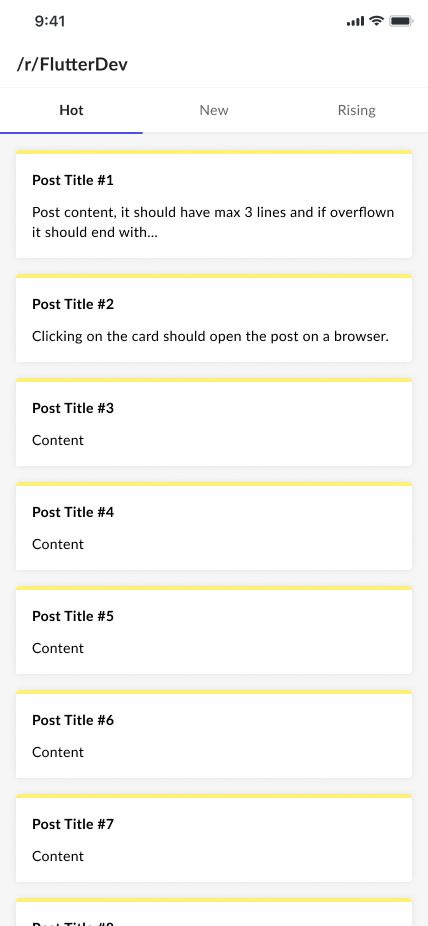

  

# Description

Hey there! Welcome to the Lepaya Flutter assignment.

This assignment is very simple. We will require you to create an app that requests and displays the `hot`, `new` and `raising` lists of the `/r/FlutterDev` subreddit.

We will provide you with a `figma` file below where you can find the necessary designs.

## What we expect from you

1. The code is clean and follow modern patterns.
2. The code is well tested, you can decide to do `unit` tests, `integration` tests, or `both`.
3. The UI is simple and follows the designs. Animations are a plus.
4. The App runs on `iOS` and `Android`.
5. Commits and MRs are clear.

## Instructions

  1. `clone` this repo. **DO NOT FORK IT**.
  2. `Create` a repository on your git provider and push the cloned repo as it is. **DO NOT MAKE ANY CHANGES TO THE REPO YET**
  3. After each of the tasks below, you will create a Merge Request with description on what you did and the reasoning for the decisions you took.
  4. In the end we expect to have 2 MRs on the repository, make sure that MR #2 targets MR #1, so that the diff is clean.
  5. If you have any question, send us a message.
  6. When you are done, invite the `hiring managers` as contributors to the repo. Their emails should have been sent to you already, but if they were not, please send us a message.

## Task #1

Add the logic for `requesting` and `storing` data from Reddit's API. Keep in mind you should add a way to request the next page as well, since it will be needed for the [Task #2](#task-2).

You can see the documentation at [https://www.reddit.com/dev/api/](https://www.reddit.com/dev/api/), make sure you are calling the correct api for the `/r/FlutterDev` subreddit.

If you decide (or not) to use a state management library, please provide a reasoning for your choice.

When you are happy with the result, open an MR just like you would when working normally.

## Task #2

Implement the UI for the app. 

Keep in mind the list on the screen is an `infinite loading` list, so make sure that works.

Pay close attention to the sizes, colors and spacings.

Clicking on a card should `open the url` of the post.

When you are happy with the UI, create another MR that targets MR #1.

Please do follow our [Figma File](https://www.figma.com/file/DiuhrhLWpujCsdbETxNfPR/Flutter-Assignment?node-id=6%3A345) as it contains the specific spacings, colors and fonts that you should use. The image bellow is just an example.

## Final

Invite the `hiring managers` as contributors to the repo. Their emails should have been sent to you already, but if they were not, please send us a message.